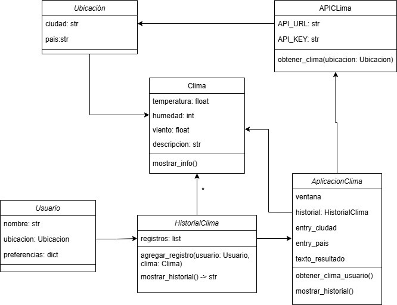

# 🌦 Aplicación CLIMAX

## Descripción del Proyecto
El acceso a información climática precisa y personalizada es fundamental para la planificación diaria,   
ya que permite a las personas tomar decisiones informadas sobre sus actividades, vestimenta y desplazamientos.    
Sin embargo, la mayoría de las aplicaciones de clima disponibles en el mercado ofrecen datos genéricos que,  
aunque útiles, no siempre se ajustan a las necesidades específicas de cada usuario.  
Muchas veces, estas aplicaciones no consideran factores individuales como la ubicación exacta,  
las condiciones climáticas de interés o las alertas personalizadas, lo que limita su utilidad en la vida cotidiana.

## El modelo del mundo para la aplicación es:

Este proyecto tiene como objetivo desarrollar una aplicación de clima personalizada que proporcione:
- `Información meteorológica en tiempo real.`
- `Pronósticos detallados para los próximos días.`
- `Alertas personalizadas según las preferencias del usuario.`

## Características de la Aplicación
### Interfaz Personalizada
- Diseño intuitivo y fácil de usar.
- Permite a los usuarios configurar sus preferencias climáticas.

### Información Meteorológica en Tiempo Real
- Datos actualizados constantemente mediante la API de OpenWeather.
- Visualización de temperatura, humedad, velocidad del viento y otras variables relevantes.

### Pronósticos Detallados
- Predicciones climáticas para las próximas horas y días.
- Información sobre probabilidades de lluvia, tormentas y cambios bruscos de temperatura.

### Alertas y Notificaciones
- Alertas meteorológicas basadas en condiciones climáticas adversas.
- Notificaciones personalizadas según las preferencias del usuario.

## Tecnologías Utilizadas
- **Lenguaje:** `Python` 🐍
- **API:** `OpenWeather`
- **Librerías:**  
`requests` Utilizada para hacer peticiones HTTP a sitios web o APIs  
`tkinter` Utilizada para crear interfaz grafica de usuario

## Repositorio de trabajo
- `https://github.com/sebastian-rendon/PrimerAvancePOO.git`

## Autores  🖋️️
- Juan Manuel Moreno Muñoz
- Kevin Stiven Aguirre Lopez
- Sebastián Rendón Grisales

